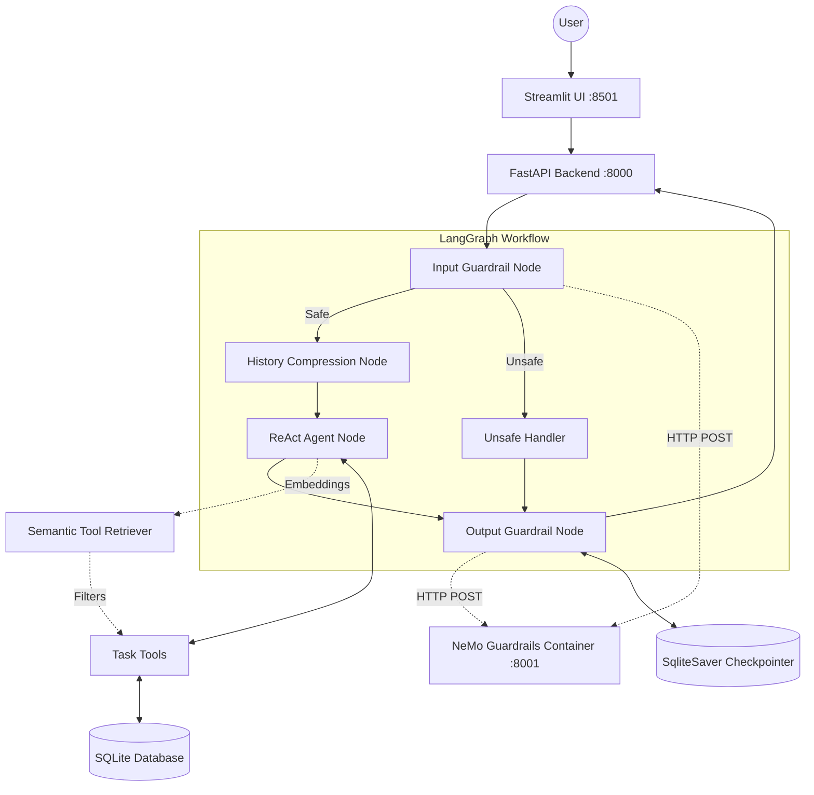

# Personal Productivity Assistant (LangChain & LangGraph)

An AI-powered Personal Productivity Assistant built using **LangChain** and **LangGraph** that manages tasks through natural language conversations.

---

## Setup Instructions

This project can be run either via Docker or locally using Poetry.

### Option A: Docker Setup

1. **Environment Variables**: Create a `.env` file in the root directory using `.env.example`.
2. **Run the Application**:
   ```bash
   docker-compose up --build
   ```
3. **Access the UI**: Open **http://localhost:8501** in your browser.

### Option B: Local Setup (Poetry)

1. **Install Dependencies**:
   ```bash
   poetry install
   ```
2. **Environment Variables**: Create a `.env` file in the root directory. 
3. **Run the Backend (FastAPI)**:
   ```bash
   poetry run uvicorn backend.main:app --reload
   ```
4. **Run the Frontend (Streamlit)**:
   Open a second terminal window and run:
   ```bash
   poetry run streamlit run frontend/app.py
   ```

---

## Architecture Diagram



---

## Assumptions Made

1. **Task Storage**: A local `tasks.db` SQLite database (managed via SQLAlchemy) would be the most lightweight and reliable permanent storage solution for the tasks.
2. **Memory Persistence**: Used LangGraph's `SqliteSaver` checkpointer to preserve conversation memory state, assuming users want seamless context retention across multiple turns.
3. **Microservices Architecture**: Structured the application into isolated Docker microservices (Frontend, Backend, Guardrails) because it's the most robust way to prevent dependency conflicts and mimic a real-world production environment.
4. **LLM Factory**: Built a dynamic LLM router, assuming that complex reasoning tasks need a "Smart" LLM (like Gemini), while simple tasks are better suited for a "Fast" local LLM (like Ollama) to optimize speed and cost.

---

## Bonus Features Implemented

1. **Follow-up Questions**: By utilizing a ReAct architecture, the assistant naturally identifies missing arguments and asks the user follow-up questions before executing a tool.
2. **Streamlit UI**: A fully interactive chat interface was built using Streamlit, communicating with the backend via REST.
3. **Semantic Tool Retrieval**: The agent dynamically embeds user queries and fetches only the relevant tools, optimizing the LLM context window.
4. **Dual-Layer Guardrails**: NVIDIA NeMo Guardrails intercept off-topic or malicious prompts securely via an isolated Docker container.
