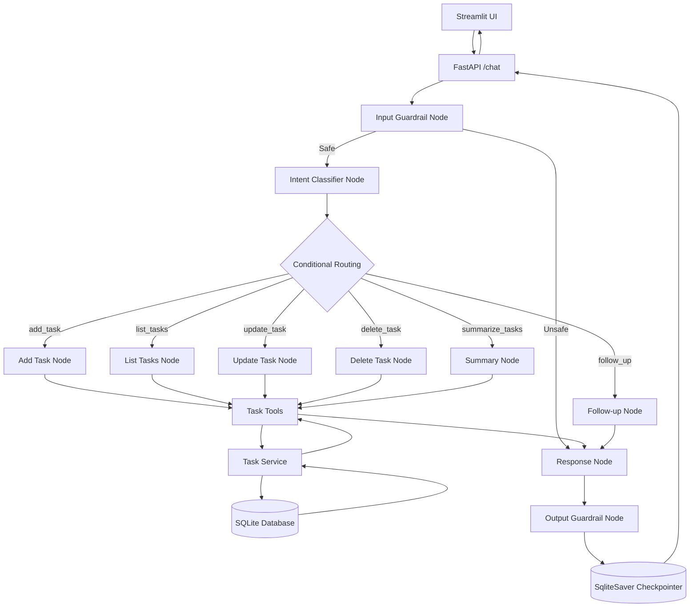

# Personal Productivity Assistant (LangChain & LangGraph)

An AI-powered Personal Productivity Assistant built using **LangChain** and **LangGraph** to manage tasks through natural language conversations. The application features state management, conditional routing, conversation memory, a Streamlit UI, and Dual-Layer safety guardrails.

---

## Setup Instructions

This project uses `poetry` for dependency management and requires a `.env` file for API keys.

1. **Install Dependencies**:
   ```bash
   poetry install
   ```
2. **Environment Variables**: Create a `.env` file in the root directory.
   ```env
   LLM_PROVIDER=gemini
   LLM_MODEL=gemini-3.6-flash
   GOOGLE_API_KEY=your_api_key_here
   ```
3. **Run the Backend (FastAPI)**:
   ```bash
   poetry run uvicorn backend.main:app --reload
   ```
4. **Run the Frontend (Streamlit)**:
   Open a second terminal window and run:
   ```bash
   poetry run streamlit run frontend/app.py
   ```

---

## Architecture Diagram



---

## Assumptions Made

1. **Storage**: Tasks are stored in a local SQLite Database (`tasks.db`) via SQLAlchemy.
2. **LLM Routing**: The system utilizes a dynamic LLM Factory allowing seamless switching between OpenAI, Groq, Cerebras, and Gemini by changing the `.env` configuration.
3. **Memory**: LangGraph's `SqliteSaver` checkpointer is used to maintain conversational state across turns.
4. **Guardrails**: The application employs Dual-Layer Guardrails. An Input Guardrail intercepts malicious prompts or off-topic requests before execution, and an Output Guardrail inspects the final AI response to prevent data leaks or hallucinations.
5. **Modular Architecture**: The codebase uses a multi-tier architecture (separating out Services, Routes, Prompts, States, etc.).
