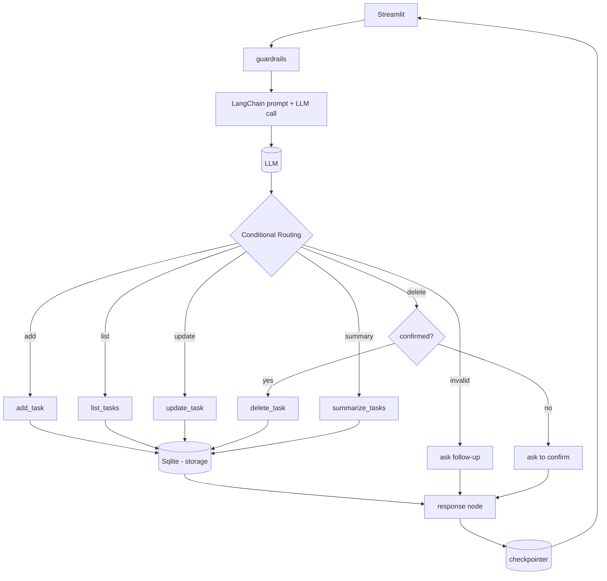

# Personal Productivity Assistant (LangChain & LangGraph)

An AI-powered Personal Productivity Assistant built using **LangChain** and **LangGraph** to manage tasks through natural language conversations. The application features state management, conditional routing, conversation memory, a Streamlit UI, and safety guardrails.

---

## Architecture Diagram

---

## Assumptions Made

1. **Local Storage**: Tasks will be stored in a local `tasks.json` file. This avoids complex database setup while successfully demonstrating LangGraph tool calling.
2. **LLM Provider**: The project assumes the use of a standard LLM like OpenAI or Google Gemini, accessible via an API key.
3. **Memory**: LangGraph's `MemorySaver` checkpointer will be used to maintain state across turns, enabling pronoun resolution (e.g., "Mark it as completed").
4. **Guardrails**: Basic conversational guardrails are needed. If the user asks the assistant to do something unrelated to productivity/tasks (e.g., "Tell me a joke" or "Write a python script for scraping"), the guardrail will intercept and guide the user back to task management.

---

